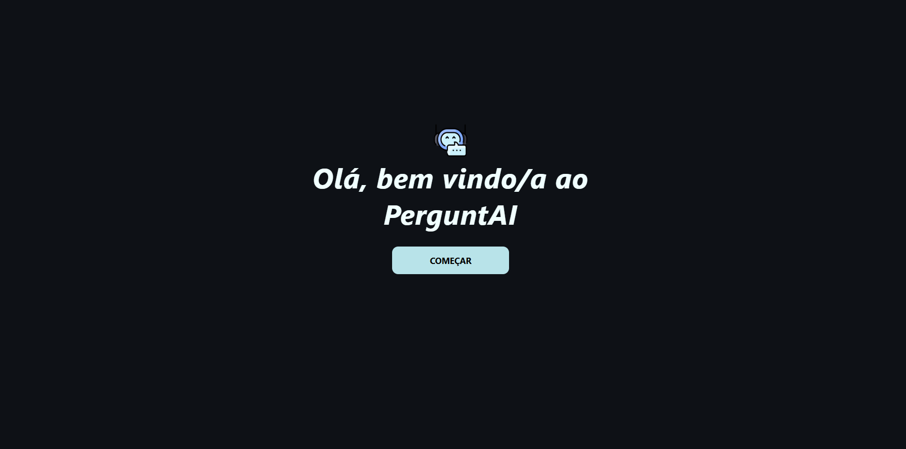
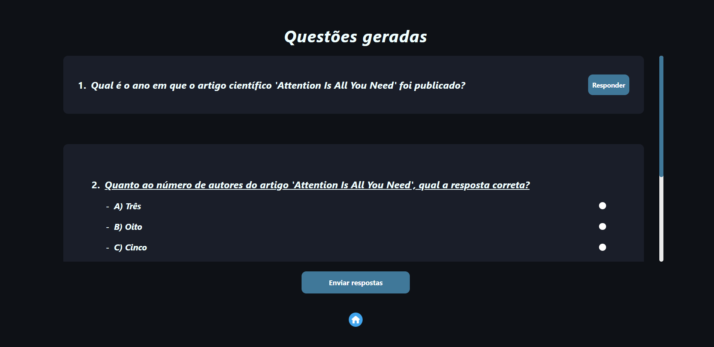
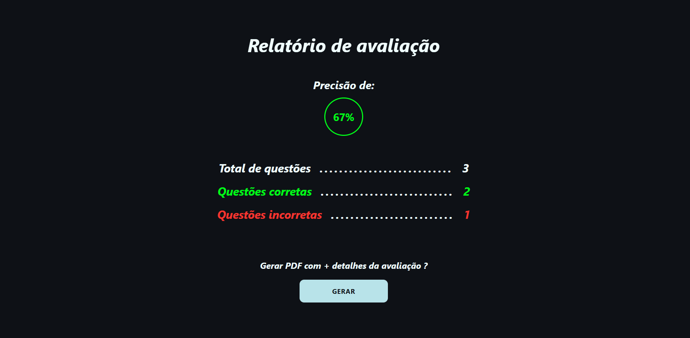
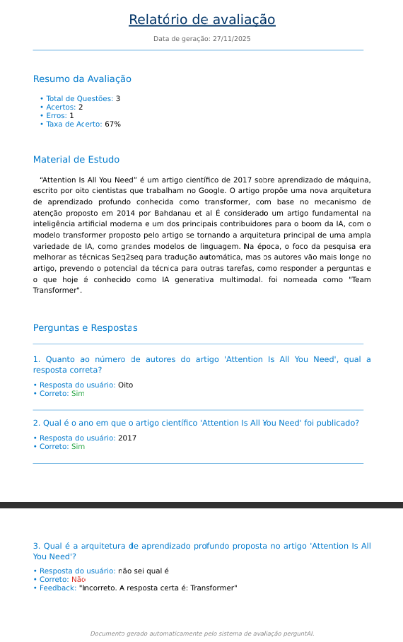

# 🧠 perguntAI — Geração Inteligente de Exercícios com IA Local (Ollama Mistral)

O **perguntAI** é uma plataforma interativa que transforma qualquer texto de estudo em **listas de exercícios geradas automaticamente** por uma LLM rodando localmente (via **Ollama Mistral**).  
Após responder as questões, o usuário recebe uma **avaliação completa** e pode **baixar um PDF** com o desempenho.

---



---

Tudo acontece **localmente**
- mantendo **privacidade total**, 
- **execução extremamente rápida**
- sem enviar **nenhum dado para a nuvem**.
- com tudo podendo rodar **offline**


## 🌟 Propósito do projeto

O objetivo do perguntAI é oferecer uma ferramenta moderna para estudos:

- **Gerar questões automaticamente** a partir de qualquer texto.
- **Privacidade absoluta** — processamento 100% local.
- **Baixa latência** — sem dependências externas.
- **Código aberto**, modular e fácil de contribuir.
- **Arquitetura extensível**, pronta para receber novos tipos de exercícios ou modelos de IA.


## 🛠️ Funcionalidades principais

### 👤 Para o usuário

- Inserir textos, resumos ou materiais de estudo.
- Selecionar quantidade/tipo de questões, dificuldade e linguagem desejada.
- Receber perguntas abertas, múltipla escolha ou misturado.
- Obter validação com base nas respostas aceitáveis.
- Visualizar um resumo de desempenho.
- Baixar um **PDF final** contendo:
  - Perguntas
  - Suas respostas
  - Respostas corretas
  - Estatísticas de acertos e erros

---



---



---



---

## 📚 Modelagem de Dados (sem banco de dados)

Toda a lógica funciona **em memória**, usando estruturas simples, transparentes e expansíveis.


## 🗂️ Estrutura do Backend (Node + TypeScript)

O backend é escrito em **Express 5**, com foco em modularidade e limpeza de camadas.

- **Express 5 + TypeScript**
- **Axios** para comunicação com o Ollama
- **PDFKit** para geração de PDF
- **UUID** para identificadores locais
- **Helmet + HPP + Compression + CORS** para segurança e otimização
- **Estrutura limpa por camadas** (controllers → services → utils)


## 🖥️ Estrutura do Frontend (React + TypeScript + Vite)

Frontend modular, organizado por features, espelhando a arquitetura do backend.

- **React 19 + Vite**
- **React Router DOM 7**
- **Context API** para gerenciamento de sessão
- **Axios** para comunicação com o backend
- **Componentes desacoplados** prontos para expansão
- **UI responsiva** seguindo os requisitos de usabilidade


## ✨ Requisitos Funcionais (resumo)

- Inserir texto e gerar exercícios
- Configurar quantidade, tipo, dificuldade e linguagem
- Validar respostas
- Exibir resumo de desempenho
- Gerar PDF com estatísticas e conteúdo
- Conectar ao Ollama local


## ⚙️ Requisitos Não Funcionais

- Até **10 segundos** para gerar perguntas localmente
- Interface responsiva e intuitiva
- Tratamento de erros (Ollama offline, timeouts, etc.)
- Funciona em qualquer navegador moderno
- Zero envio de dados para servidores externos
- Código modular e extensível


## 🌍 Objetivo Open-Source

O perguntAI foi desenvolvido para ser:

- **Simples de entender**
- **Fácil de modificar**
- **Ideal para aprendizado**
- **Aberto para contribuições da comunidade**

Novas features futuras incluem:

- 🎨 tema claro/escuro  
- 🧪 novos tipos de exercícios  
- 🤖 suporte a diferentes LLMs no Ollama


## 🐋 Instalação e execução com Docker


### Pré-requisitos
Antes de iniciar o perguntAI, certifique-se de possuir instalado:
- Docker Desktop
- Git

> Todos os outros serviços são executados em containers Docker.

---

### Clonar o projeto
```bash
- git clone https://github.com/Viniciusrodd/perguntAI.git

- cd perguntAI
```

---

### Primeira execução
Na primeira execução é necessário baixar o modelo utilizado pela IA.
Abra a pasta `launcher` e execute:
```
install.bat
```

O instalador irá:
- iniciar todos os containers
- baixar o modelo `mistral:7b-instruct-q4_0`

> O primeiro download pode levar alguns minutos, dependendo da velocidade da internet.

---

### Executando a aplicação
Após a instalação inicial, basta executar:
```
start.bat
```
O script irá:
- iniciar todos os containers
- abrir automaticamente o navegador em
```
http://localhost:3000
```

---

### Encerrando a aplicação
Quando terminar de utilizar o perguntAI, execute:
```
stop.bat
```
Esse script interrompe todos os containers da aplicação, liberando memória e processamento da máquina.


## ⚠️ Requisitos de hardware
- 8 GB de RAM (mínimo)
- 16 GB de RAM (recomendado)
- CPU com múltiplos núcleos
- Aproximadamente 8 GB de espaço livre para os modelos e imagens Docker


## 🚀 Instalação e execução local (outra opção)

Você terá dois arquivos .bat na raiz do projeto:

- **install-perguntai.bat** → instala e prepara o ambiente
- **start-perguntai.bat** → inicia tudo automaticamente

O usuário **não precisa entender de programação** — basta seguir alguns passos simples.


### Pré-requisitos

Antes de instalar, é necessário ter instalado:

- **✔ Node.js (LTS)**: https://nodejs.org/en/download
- **✔ Git**: https://git-scm.com/downloads
- **✔ Ollama (obrigatório)**: https://ollama.com/download

O Ollama é o serviço responsável por rodar o modelo Mistral localmente.


### Baixe ou clone o repositório

#### Download ZIP

- Clique em Code → Download ZIP
- Depois, extraia o projeto em uma pasta local (por exemplo: **C:\perguntai**).

#### Ou clone via Git

``` bash
   git clone https://github.com/Viniciusrodd/perguntAI.git
   cd perguntAI
```

### Instale tudo com 1 clique

Na pasta raiz, execute:

``` bash
   install_perguntAI.bat
```

Esse instalador irá: 

- ✔️ Verificar se **Node, npm e Ollama** estão **instalados**
- ✔️ Instalar **dependências do backend**
- ✔️ Instalar **dependências do frontend**
- ✔️ Validar que o projeto está **pronto para rodar**

Se faltar algo, ele mostrará exatamente o que instalar.


### Iniciando o projeto (modo automático)

Depois da instalação, execute:

``` bash
   start_perguntAI.bat
```

Esse script:

- 🧠 inicia o Ollama Server
- 🖥️ inicia o backend
- 🌐 inicia o frontend
- 📌 cria automaticamente um atalho na área de trabalho (somente na primeira execução)
- 🌍 abre o navegador em http://localhost:5173/
- 🔄 reinicia serviços automaticamente se estiverem ocupando as portas

Você verá três janelas separadas:

``` bash
   1 — Servidor Ollama (ollama serve)
   2 — Backend (Node + Express)
   3 — Frontend (React + Vite)
```

Basta não fechar essas janelas enquanto estiver usando o sistema.


### Acessando o sistema

Ao rodar o script, o navegador abrirá automaticamente:

- 👉 http://localhost:5173/

Caso prefira abrir manualmente, use o atalho:

- 📌 **PerguntAI.lnk** criado na **Mesa/Área de Trabalho**.


### Como parar o sistema

Para encerrar tudo corretamente:

- feche a janela "Ollama Server"
- feche a janela "PerguntAI Backend"
- feche a janela "PerguntAI Frontend"

Ou simplesmente:

``` bash
   CTRL + C
```

em cada terminal.


### Como atualizar o projeto

Se baixar uma nova versão do GitHub:

- Baixe/extraia novamente
- Substitua a pasta antiga
- Execute novament

``` bash
   install-perguntAI.bat
```

para reinstalar dependências que possam ter mudado.


## Problemas comuns (e como resolver)

### ❌ Erro: “Ollama não encontrado”

Instale o Ollama pelo site e reinicie o PC.


### ❌ Erro: “Porta 5173 já está em uso”

O script já mata a porta automaticamente, mas se falhar:

```bash
   taskkill /F node.exe /IM
```


### ❌ Vite não inicia / branco na tela

Rode manualmente:

```bash
   cd frontend
   npm install
   npm run dev
```


### ❌ Backend não inicia

Rode manualmente:

```bash
   cd backend
   npm install
   npm run dev
```


## Suporte e contribuições

Sinta-se à vontade para:

- abrir issues
- enviar PRs
- sugerir melhorias
- propor novos tipos de exercícios
- integrar novos modelos

### A comunidade é bem-vinda aqui 🤙
